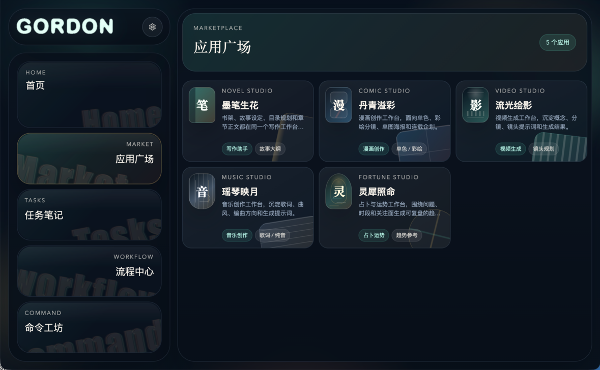

# x-bot-gordon

**Gordon**，也可以叫 **Gord** 或 **gord**，是一个面向工作场景的桌面端 + CLI 双端助手。当前这版不是直接堆功能，而是先把一个可持续迭代的骨架搭好：统一内核、独立记忆库、可扩展模型接入层，以及面向数据库 / 工作清单 / 飞书等模块的能力边界。



## 目标概览

| 维度 | 当前定义 |
|---|---|
| 产品定位 | 工作助手，辅助处理工作中的大小事宜 |
| 运行形态 | 桌面端程序 + CLI |
| Agent 形态 | Harness agent，可持续自我优化成长 |
| 记忆体系 | 参考资料库（reference）+ 经验库（experience） |
| 模型接入 | OpenAI、Anthropic、Google、OpenAI-like |
| 多模态目标 | text、vision、audio、tts、embedding、image、video、music |
| 工作模块 | 数据库、工作清单、日报辅助、飞书文档/表格 |
| 演进策略 | 模块化扩展，不为未来功能设上限 |

## 目录结构

| 路径 | 作用 |
|---|---|
| `apps/cli` | `gord` 命令行入口 |
| `apps/desktop` | Electron 桌面端入口和 UI |
| `packages/shared` | 共享类型与路径工具 |
| `packages/core` | Gordon 的领域模型与工作台聚合逻辑 |
| `packages/memory` | 本地 JSON 记忆库读写 |
| `packages/providers` | 模型供应商（provider）连接器目录 |
| `packages/workbench` | 数据库、任务、飞书等工作模块定义与示例仓储 |
| `data` | 本地示例数据：记忆库、任务、数据库配置 |
| `docs` | 架构说明与后续扩展约束 |

## 已落地的基础能力

| 能力 | 当前状态 |
|---|---|
| Gordon 身份与产品蓝图 | 已定义 |
| 统一工作台快照（snapshot）聚合 | 已定义 |
| 本地记忆库存储 | 已实现 |
| Provider 连接器目录 | 已实现 |
| 数据库 / 工作清单 / 飞书模块清单 | 已实现 |
| CLI 浏览与写入记忆 | 已实现 |
| 桌面端总览页面 | 已实现 |

## 命令

```bash
pnpm install
pnpm check
pnpm dev:cli -- summary
pnpm dev:cli -- providers
pnpm dev:cli -- memory list references
pnpm dev:desktop
```

## 设计原则

1. **先统一核心，再扩展能力**：桌面端、CLI、后续 API 共用同一套领域模型。
2. **记忆和业务分层**：参考资料库记录“看过什么”，经验库记录“学会了什么”。
3. **能力注册优先**：模型接入、工作模块、连接器都以声明式注册为主。
4. **本地优先**：先用本地 JSON 保持低门槛，后续可替换成 SQLite / Postgres / 向量库。
5. **为无限扩展预留接口**：现在就给数据库、飞书、多模态、日报等模块定义好扩展点。

更多细节见 [docs/architecture.md](/Users/songguodong/Workspace/ITMaas/x-bot-gordon/docs/architecture.md)。
